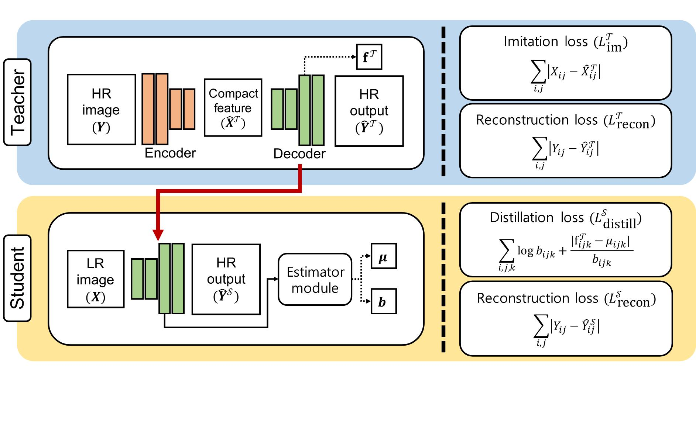

# PyTorch implementation of PISR

This is an official implementation of the paper "Learning with Privileged Information for Efficient Image Super-Resolution", accepted to ECCV2020.

This work effectively boosts the performance of FSRCNN by exploiting a distillation framework, treating HR images as privileged information.

For more information, checkout the project site [[website](https://cvlab.yonsei.ac.kr/projects/PISR/)] and the paper [[PDF](https://arxiv.org/pdf/2007.07524.pdf)].

## Overview of our framework


# Getting started 

## Dependencies
* Python 3.6
* PyTorch >= 1.1.0
* Please check [requirements.txt](requirements.txt)

## Docker
We provide a [Dockerfile](Dockerfile) to reproduce our work easily. 
```bash
$ docker build -t pisr:latest . # or docker pull wonkyunglee/pytorch_pisr:latest
$ docker run -it -v <working_dir>:/data -w /data pisr:latest /bin/bash
```


## Datasets
* For training and validation
    - DIV2K
* For evaluation
    - Set5
    - Set14
    - B100
    - Urban100

Please download DIV2K dataset from [here](https://cv.snu.ac.kr/research/EDSR/DIV2K.tar) and other benchmark datasets from [here](https://cv.snu.ac.kr/research/EDSR/benchmark.tar).


After download all datasets, the folder ```data``` should be like this:
```
    data
    ├── benchmark
    │   ├── B100
    │   ├── Set14
    │   ├── Set5
    │   └── Urban100
    │       ├── HR
    │       └── LR_bicubic
    │           ├── X2
    │           ├── X3
    │           └── X4
    │      
    └── DIV2K
        ├── DIV2K_train_HR
        └── DIV2K_train_LR_bicubic
            ├── X2
            ├── X3
            └── X4

```

## Training
First, clone our github repository.
```bash
$ git clone https://github.com/yonsei-cvlab/PISR.git
```
To train our teacher model, run the following script. 
```bash
$ python step1_train_teacher.py --config configs/fsrcnn/step1.yml
```

To train our student model, run the following script. 
```bash
$ python step2_train_student.py --config configs/fsrcnn/step2.yml
```

## Using the pretrained models
* Download pre-trained weights for teacher model into ``results/fsrcnn/fsrcnn_teacher/checkpoint/`` folder. <br>Link: [[weights](https://drive.google.com/file/d/1amqpIg7ah0bJX7jfWXYRitg6y3xlCYhd/view?usp=sharing)]
* Download pre-trained weights for student model into ``results/fsrcnn/fsrcnn_student/checkpoint/`` folder. <br>Link: [[weights](https://drive.google.com/file/d/1ZHyapgp_vhvITODV6Fyac7YQ2zxHQy8f/view?usp=sharing)]

## Evaluation
To evaluate our student model, run following script. Benchmark datasets can be choosed by editing the config file ``configs/fsrcnn/base.ram.yml``.
```
$ python evaluate.py --config configs/fsrcnn/step2.yml
```

--- 
## Citation
```
@inproceedings{lee2020pisr,
    author={Lee, Wonkyung and Lee, Junghyup and Kim, Dohyung and Ham, Bumsub},
    title={Learning with Privileged Information for Efficient Image Super-Resolution},
    booktitle={Proceedings of European Conference on Computer Vision},
    year={2020},
}
```
--- 
## Credit
Some parts of this code (e.g., data_loader) are based on [EDSR-PyTorch](https://github.com/thstkdgus35/EDSR-PyTorch) repository.

